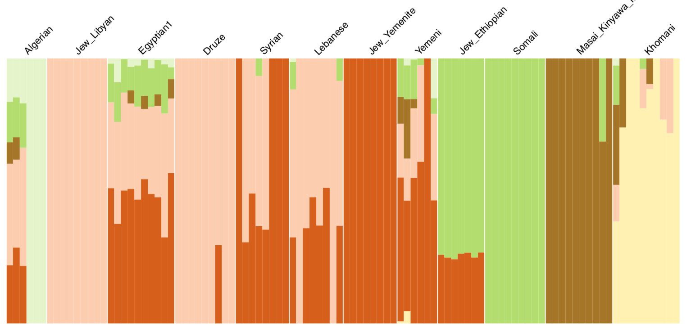

## A dataset of Human Diversity

In this exercise we are going to work with a SNP dataset typed for different human populations. The purpose of these analysis is to understand human variation through population history. We are chosing a SNP chip array designed by for maximizing information on human diversity and demographic events, named Human Origins (Affymetrix). The design of this SNP chip includes variants found in populations from different continents, and minimizes ascertainment bias.

We will be working with PLINK, a software for data manipulation and basic statistics, and ADMIXTURE for reconstructing different ancestry across individuals.

We will be starting with a dataset of 100 individuals and 14 populations from Africa and Middle East. Published data is taken from [Patterson et al. 2012](https://reich.hms.harvard.edu/sites/reich.hms.harvard.edu/files/inline-files/2012_Patterson_AncientAdmixture_Genetics.pdf) 
and [Lazaridis et al. 2014](https://reich.hms.harvard.edu/sites/reich.hms.harvard.edu/files/inline-files/2014_Nature_Lazaridis_EuropeThreeAncestries.pdf) .


```{r echo=FALSE ,message=FALSE, warning = FALSE}
infoo<-read.table("infopopExercis.txt", as.is = T, header=T,quote = "", sep="\t")
library("maps")
library("ggrepel")
map.world<-map_data(map="world")
gg <- ggplot()
gg <- gg + theme()
gg <- gg + geom_map(data=map.world, map=map.world, aes(map_id=region), fill="white", colour="black", size=0.15)
gg<- gg+coord_quickmap(ylim=c(-30,40), xlim=c(0,50))+
  geom_label(data=infoo,aes(x=lon, y=lat,label =PopName)) +
geom_label_repel(force = 1)
gg
```

We are working local, from your computer. You can download the data from Github

```
git clone https://github.com/chiarabarbieri/Bio373_Blockcourse.git
```


___________________________

# PLINK

Available at  <https://www.cog-genomics.org/plink/1.9/>.
Tool created for genome-wide association studies (GWAS) and research in population genetics. 
PLINK parses each command line as a collection of flags (each of which starts with two dashes), plus parameters (which immediately follow a flag).  Because PLINK was developed for GWAS medical studies, many basic informations will be not used in our analysis, such as pedigree or phenotype.


### Different formats for input files

PLINK can take different inputs, including .vcf. The native PLINK formats consist of tables of samples and variant calls.

The formats come in two version: binary (bed + bim + fam) and text (ped + map).

The .ped includes ID, pedigree(optional) + genotype table, the .map is basically the list of SNPs with chromosome position and alleles. The two (or three) files have to be called with the same name.

*.bed* for binary and *.ped* for text files:
Containing the genotype information. One line per individual.

The *.ped* file contains also information on the individual. In the binary form this is contained in the .fam file.
The first six columns of the *.ped*  (mandatory), and the *.fam* therefore look the same:
     
     Family ID
     Individual ID
     Paternal ID
     Maternal ID
     Sex (1=male; 2=female; other=unknown)
     Phenotype (for association studies)


*.map* for text files:
list of markers.
Each line of the MAP file describes a single marker and must contain exactly 4 columns:

     chromosome (1-22, X, Y or 0 if unplaced)
     rs# or snp identifier
     Genetic distance (Centimorgans)
     Base-pair position (bp units)
     

*.bim* for binary 
Each line of the MAP file describes a single marker and must contain exactly 6 columns.
It is an extended .map file with two extra columns for allele names.
     


### From one format to another

The command like of PLINK is 

```
plink --file yourfile --flag modifiers that makes some action on your file
```

where *yourfile* is the root name of the two text files .ped and .map. if you use the flag --bfile, instead, you call the three binary files .bed, .bin and .fam.

We start with some example: pass from one file format to the other and look at the differences between them on the terminal.

```
plink --bfile HumanDataHO --recode
```

Explore the newly generated files.

Navigate the online material and find which flags you can use to turn the file into a vcf format. 

Other useful tools: subest a list of SNP, subset a list of individuals, merge two datasets. 


## Basic population genetics tools

Generate some simple summary statistics: rates of missing data in the file. Diversity within the samples and between the samples.

### Missing data

Use the flag --missing and explore the outputs. How is the rate of missing data per individual and per marker looking like?

```
plink --bfile HumanDataHO --missing
```


```{r echo=FALSE}
library("ggplot2")
aa<-read.table("missing.imiss", header=T)
ggplot(aa, aes(FID,F_MISS))+
         geom_boxplot()+
     theme(axis.text.x = element_text(angle = 45, vjust=1, hjust=1)) +
   labs(title = "percentage of missing data per individual")

```


### Heterozygosity - inbreeding - consanguinity 


We run another plink command to explore F, the degree of consanguineity, and eventually delete outliers with a very high F.

*--het* computes observed and expected autosomal homozygous genotype counts for each sample, and reports method-of-moments F coefficient estimates (i.e. ([observed hom. count] - [expected count]) / ([total observations] - [expected count])) to plink.het. 


```
plink --bfile HumanDataHO --het
```

Visualize the difference in heterozygosity within populations.

```{r message=FALSE, warning = FALSE}
het<-read.table("plink.het", header=T)
pdf("het.pdf")
ggplot(het, aes(FID,F))+
         geom_boxplot()+
     theme(axis.text.x = element_text(angle = 45, vjust=1, hjust=1)) +
   labs(title = "homozygosity per individual")
   dev.off()
```


```{r  message=FALSE, warning = FALSE}

infoo<-read.table("infopopExercis.txt", as.is = T, header=T,quote = "", sep="\t")
infoo$het<-NA
for (i in 1:nrow(infoo)){
  temp<-het[which(het$FID==infoo$PopName[i]),]
  infoo$het[i]<-mean(temp$F)
}
library("maps")
map.world<-map_data(map="world")
pdf("het_map.pdf")
gg <- ggplot()
gg <- gg + theme()
gg <- gg + geom_map(data=map.world, map=map.world, aes(map_id=region), fill="white", colour="black", size=0.15)
gg<- gg+coord_quickmap(ylim=c(-30,40), xlim=c(0,50))
gg + geom_point(data=infoo, aes(x=lon, y=lat, color=het), size=5 )+
  scale_color_gradient(low = "blue", high = "red") +
  ggtitle("Intensity of homozygosity in each population")
   dev.off()

```

Does the diversity fit an Out Of Africa model for human migrations?

___________________________

## PCA

With the modifier *--pca*. PLINK extracts the top 20 principal components of the variance-standardized relationship matrix. 
The results consist in a *.eigenvec* file with the coordinates for each individual in rows and eigenvectors in columns, and a *.eigenval* which explains how much variance there is in the data for that given vector. 

```{r message=FALSE, warning = FALSE}
eigenvec<-read.table("plink.eigenvec")
eigenval<-read.table("plink.eigenval")

library("ggplot2")
library("RColorBrewer")
library("colorRamps")
pdf("pca.pdf")
gg<-ggplot(eigenvec,aes(V3,V4, color=V1))+
  geom_point()+
 labs(x = eigenval[1,], y=eigenval[2,],title = "PCA analysis dimension 1 vs. 2")+
scale_color_manual(values = colorRampPalette(brewer.pal(12,  "Accent"))(12))
gg
   dev.off()

```

One group is clearly an outlier. Repeat the analysis after excluding this population.

___________________________

# ADMIXTURE analysis


Identifying ancestry components shared between individuals of a set of populations.

ADMIXTURE is a software that works similarly to Structure, but with faster computation time. Download and manual from https://www.genetics.ucla.edu/software/admixture/. It takes plink format input files.


### Pruning

First, we prune the dataset for excluding the SNPs in Linkage, with Plink. The resulting file will have less SNPs, and the computation will be faster. 

The settings define window size, step and the r2 threshold.

```
plink --bfile HumanDataHO --indep-pairwise 200 25 0.4 --out x.tmp
plink --bfile HumanDataHO --extract x.tmp.prune.in --recode12 --out HumanDataHO_pruned
```

How many SNPs are left after pruning?


### ADMIXTURE run

Now the proper ADMIXTURE run. The following commands will run ADMIXTURE for each *K* (number of ancestry blocks) desired. One value of *K* will be more supported by the analysis: the one with the lowest associated cross-validation error. This *K* will be considered as the best representation of the actual data variation.

```
typeset -i run=0
for K in 2 3 4 5; do  # select a meaningful series of K - the more Ks, the longer the run obviously
admixture -s time --cv HumanDataHO_pruned.ped $K | tee log.K${K}.RUN1.out;
mv HumanDataHO_pruned.$K.P K$K.Run1.P;
mv HumanDataHO_pruned.$K.Q K$K.Run1.Q;
done
```
For each run there are three output: .out, .P, and .Q

Now we will elaborate the outputs with a mix of bash commands and *R*.

### Cross-validation error to identify the best value of *K*

```
grep -h CV log*out > CV.txt
```
plot the distribution of values associated to each K in R.

```{r message=FALSE, warning = FALSE}

read.table("CV.txt")->cv  

# set which one was the smallest and the largest K that you ran
minK<-2
maxK<-10

ordine<-c()
for (k in minK:maxK){
  ordine[k]<-paste("(K=",k,"):",sep="", collapse = "")
}

ordine <- ordine[!is.na(ordine)]

library(ggplot2)

p <- ggplot(cv, aes(x=V3, y=V4)) + 
  geom_boxplot()+ 
  ggtitle("values associated to each K")+
  scale_x_discrete(limits=ordine)
  
p
```

I previously run 5 iterations for each K and determined which of the 5 runs has the highest likelihood. This is to exclude the chance that some run did not perform correctly.

_______________


### Plotting the ADMIXTURE results for each K

prepare to plot: information to plot on the admixture bars, from your external info population file


```

MYINFO<-read.table("infoAdmixtureExercis.txt", header=T, as.is=T)


table(MYINFO$population)->pops
namespop<-unique(MYINFO$population)

my.labels <- vector()   ## plotting pop labels instead of sample ids
for (k in 1:length(namespop)){
  paste("^",namespop[k],"$",sep="")->a
  length(grep(a, MYINFO$population)) -> my.labels[k]
}

labels.coords<-vector()  ### where to plot pop labels
labels.coords[1]<-my.labels[1]/2
for (i in 1:(length(my.labels)-1)) {
  labels.coords[i]+(my.labels[i]/2+my.labels[i+1]/2)->labels.coords[i+1]
}
z<-vector()
z[1]<-my.labels[1]
for (i in 1:(length(my.labels)-1)){
  z[i]+my.labels[i+1]->z[i+1]
}

# select a color palette
# you can use colorbrewer. put together a number of colours equal Kmax.

library(RColorBrewer)
qual_col_pals = brewer.pal.info[brewer.pal.info$category == 'qual',]
col_vector = unlist(mapply(brewer.pal, qual_col_pals$maxcolors, rownames(qual_col_pals)))
colorchoice<-sample(col_vector, maxK)
#pie(rep(1,maxK), col=coso)

# now plot for each K
K<-2 # chose the K to plot. Start with the lowest.

valuesToplot<-read.table(paste("K",K,".Run1.Q", sep="", collapse = ""))

valuesToplotSort<-valuesToplot[MYINFO$oderAdmix,]

#pdf(paste("AdmixtureForK",K,".pdf", sep="", collapse = ""),pointsize=8, height=3.5)

barplot(t(as.matrix(valuesToplotSort)), col=colorchoice[1:K], axisnames=F, axes=F, space=0,border=NA)
axis(3, labels = FALSE, tick=F)
for (i in c(0,z)){
  lines(x=c(i,i),y=c(0,3), lwd=0.7, col="white")
}
text(labels.coords, par("usr")[3] + 1.03 , srt = 45, adj = 0, labels = namespop, cex=0.7, xpd = TRUE)
#dev.off()

```




Look at patterns across populations. Do they follow a geographic structure? Is there a sign of Admixture?

... 


# SECOND PART: PHYLOGENIES

### Handling sequence data and a matrix of distances

Handling genetic alignments, genetic distance, trees, genetic distance between populations.
Sequence data from Barbieri et al. 2013 "Unraveling the Complex Maternal History of Southern African Khoisan Populations"" (mitochondrial sequences mtDNA)
Original sequences are deposited at <http://www.ncbi.nlm.nih.gov/popset?DbFrom=nuccore&Cmd=Link&LinkName=nuccore_popset&IdsFromResult=444211048>

This part of the tutorial will be performed in R.

## 1. Sequence alignment

Load packages in R with the analysis that you will need.

```{r, message=FALSE, warning=FALSE}
library(ape, adegenet)
library(phangorn)
library (lattice)
library(MASS)

```

Import the sequence data
```{r}
seq<-read.dna("reducedSet100sequences.fasta", format="fasta")
```
*IMPUTATION* 
Here I use an imputed DNA alignment to minimize the amount of missing data, and the consequent uncertainity in phylogenetic reconstruction! Positions with missing data were replaced by the same base of the closest sequences in the whole dataset. 

check the alignment!
``` {r seq}
print(seq)
```


# 2. Tree based on individual distances  - NJ

Now we calculate a simple genetic distance between sequences.

```{r}
dist.matrix <- dist.dna(seq) # Calculate distance matrix
m5<- as.dist(dist.matrix, diag=F, upper=F)
```
We create a Neighbour Joining tree from the matrix of pairwise distance
```{r}
treeRED<-nj(m5)   #create the object neighbour joining tree 
treeRED$edge.length[treeRED$edge.length < 0] = 0.002 #little trick to avoid negative branches
```
Plot the tree and add a legend
```
plot.phylo(treeRED, type="u", tip.col="blue", cex=0.3 ) #plot the tree as unrooted

```
here the tree without colors

```{r, echo=FALSE}
plot(treeRED, type="u", cex=0.3 ) #plot the tree as unrooted
```

## 3. Maximum Parsimony analysis on sequences
```
fasta.phyDat  <- as.phyDat(seq) # convert to phangorn data type
njtree <- nj(dist.matrix) # Calculate NJ tree
parsimony(njtree, fasta.phyDat) # Determine the tree length of NJ tree
tree.optim <- optim.parsimony(njtree, fasta.phyDat) # more settings: weight matrix, algorithm
```

Parsimony Ratchet algorithm
```
tree.pratchet <- pratchet(fasta.phyDat, maxit=100, k=10, rearrangements="SPR")
```
 Root tree: I have an outlier, a sequence from a Neandertal bone remain.
```
tree.pratchet <- root(tree.pratchet, match("Neandertal", tree.pratchet$tip.label), resolve.root=T)
```
Annotate with the number of mutations per branch
```
tree.pratchet <- acctran(tree.pratchet, fasta.phyDat)
```
 Plot tree
```
plot(tree.pratchet, tip.col="blue", cex=0.3)
edgelabels(tree.pratchet$edge.length)
```
 Write the tree to a file
```
write.tree(tree.pratchet, file="output.tree")
```
now you can open it with FigTree or SplitsTree if you want!

download the software FigTree <http://tree.bio.ed.ac.uk/software/figtree/>


Plus: check the number of mutations. How old is the root of the tree? Soares et al. (2009) calculated the mutation rate of the whole mtDNA genome molecule to be one mutation every 3624 years. <http://www.sciencedirect.com/science/article/pii/S0002929709001633/>


# 4. Trees based on population distance
### Neighbour Joining tree populations
Visualize population distances with a tree (unrooted). Find outliers.
I will use an external file to add a color coding to the populations, corresponding to their Language Family.

```{r}
popOrder <- read.table("popOrderColor", as.is=T)
mat = read.table("matrix_mtDNA_popdist.txt",sep="\t", header=T) #matrix of distances between populations
colnames(mat)<-rownames(mat) 
 	replace(mat,mat <0, 0) -> m3## does not accept negative values

m4<-m3+0.0001      ## does not accept values==0
diag(m4)=0
m5<- as.dist(mat, diag=F, upper=F)
treeTest<-nj(m5)
treeTest$edge.length[treeTest$edge.length < 0] = 0.002
rownames(popOrder)<-popOrder[,1]
popOrder2<-popOrder[treeTest$tip.label,]
plot.phylo(treeTest, type="u", tip.col=popOrder2[,2] )
nomi<-c("Bantu","Khoe","Kx'a","Tuu")
legend("topleft",nomi,text.col=c("darkmagenta","blue","green","red"))
```

### UPGMA tree populations

```{r}
upgmatree<-upgma(m5)
plot.phylo(upgmatree,  tip.col=popOrder2[,2] )
legend("topleft",nomi,text.col=c("darkmagenta","blue","green","red"))
```

What are the differences between the two trees?
